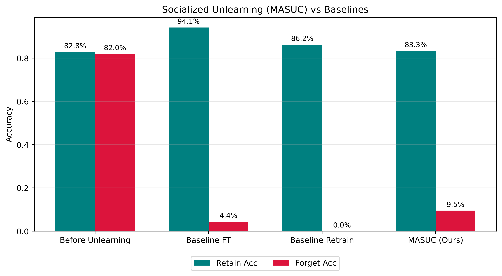

# MASUC: Multi-Agent Socialized Unlearning Framework

<div align="center">
  
  <br><br>
  <em>Comparison of unlearning methods on CIFAR-10, forgetting Class 3 (Cat) using a ResNet-18 backbone.</em>
</div>

---

## Table of Contents

1. [The Problem: Machine Unlearning](#1-the-problem-machine-unlearning)
2. [Why Existing Approaches Fall Short](#2-why-existing-approaches-fall-short)
3. [Our Approach: Socialized Unlearning](#3-our-approach-socialized-unlearning)
4. [Technical Deep Dive](#4-technical-deep-dive)
   - [The Teacher Society](#41-the-teacher-society)
   - [Phase 1 — Reciprocal Altruism](#42-phase-1--reciprocal-altruism)
   - [Phase 2 — Collaborative Unlearning](#43-phase-2--collaborative-unlearning)
   - [Loss Functions](#44-loss-functions)
5. [Repository Structure](#5-repository-structure)
6. [Results](#6-results)
7. [Usage Guide](#7-usage-guide)

---

## 1. The Problem: Machine Unlearning

Deep neural networks do not simply "learn patterns" — they memorize specific training examples within their weights. This has become a serious legal and ethical concern. Regulations like the **GDPR** grant individuals a *Right to be Forgotten*, meaning a data owner can request that their data be removed from a trained model. Similar concerns arise with:

- **Toxic or biased content** accidentally encoded in the weights during training.
- **Copyright violations**, where a model has absorbed protected material.
- **Privacy leakage**, where membership inference attacks can reconstruct training data.

The naive solution — retrain the entire model from scratch excluding the forbidden data — is mathematically correct and defines the **Gold Standard**. In practice, however, it is computationally intractable: for large architectures and datasets, a full retraining cycle can take many hours or days of GPU compute. On a modern Apple Silicon M4, for instance, retraining a ResNet-18 on CIFAR-10 takes around 12 hours.

The challenge of **Machine Unlearning** is therefore: *how do you surgically remove a specific concept from a trained model as cheaply as possible, while preserving its performance on everything else?*

---

## 2. Why Existing Approaches Fall Short

### Fine-Tuning (FT)

The most common practical baseline is to take the pre-trained model and continue training it on the *Retain Set* — the portion of the dataset that does not include the data to be forgotten.

This approach has two critical failure modes, both visible in our experiments:

**It over-specializes.** The model no longer needs to distinguish 10 classes; it only sees 9. All its representational capacity gets redirected to the easier task, and accuracy on the retain classes *increases abnormally* (from 82.79% to 94.13% in our case). This is not desirable: the goal is to produce a model that behaves as if it had simply never seen the forgotten data, not a model that has been restructurally altered.

**It does not reliably forget.** Fine-Tuning drives down forget-set accuracy, but only because it overwrites weights indiscriminately. The forgetting is a side effect of catastrophic interference, not a deliberate erasure. It is also slow to converge compared to targeted unlearning methods.

### Retraining from Scratch

This is the Gold Standard but not a practical solution. It serves as the theoretical ceiling in our benchmark — the result any unlearning method should try to approximate.

---

## 3. Our Approach: Socialized Unlearning

MASUC treats unlearning not as a solitary optimization problem but as a **social learning process**, drawing a loose analogy from evolutionary biology and social learning theory.

The core intuition is this: if you want a model to forget a concept, do not ask it to figure out what forgetting looks like on its own. Instead, surround it with *teachers who have never learned that concept in the first place*, and have it absorb their structure.

MASUC builds a **society of teacher models**. Each teacher has been trained on the full dataset *minus one specific class*, making them structurally blind to that concept. When the student model needs to unlearn a class, it enters a two-phase protocol mediated by this teacher society.

The result is a model that:
- Has near-zero accuracy on the forgotten class (~9.5%, close to random chance for 10 classes).
- Retains essentially the same accuracy on all other classes (~83.3%, vs. 82.79% before unlearning).
- Is obtained in approximately 1 hour, compared to ~12 hours for a full retrain.

---

## 4. Technical Deep Dive

### 4.1 The Teacher Society

We pre-train 5 teacher models on CIFAR-10, each blind to a different class:

| Teacher | Blind to Class |
|:-------:|:--------------:|
| 0 | 3 (Cat) |
| 1 | 7 |
| 2 | 1 |
| 3 | ... |
| 4 | ... |

Each teacher is a ResNet-18 trained to convergence on 9 of the 10 classes. Their weights encode a strong representation of the retained classes, and a structural void where the forgotten class would be.

**An important subtlety:** when unlearning Class 3 (Cat), not all 5 teachers are natively blind to cats. Some of them have seen Cat examples during their own training. This would seem to be a problem — wouldn't those teachers reintroduce Cat knowledge during distillation?

MASUC resolves this dynamically during the **Reciprocal Altruism** phase (described below): before any teacher is allowed to act as a mentor, it is temporarily silenced on the target class via an Erasure loss. This ensures that *all* teachers, regardless of their own training history, provide Cat-free guidance during the unlearning loop.

---

### 4.2 Phase 1 — Reciprocal Altruism

In each training iteration, before the student updates its weights, a **teacher adaptation step** occurs.

Each teacher receives the current input batch. Rather than using its own internal feature extractor, it takes the **feature vector produced by the student's penultimate layer** and passes it through its own classification head. This forces the teacher to operate in the student's current representational space, not its own.

The teacher then minimizes a Knowledge Distillation loss between its own output (computed on student features) and the student's output. In practice, this means the teacher continuously recalibrates itself to "speak the same language" as the student at its current state of learning. The feedback the teacher provides is always calibrated to where the student is right now — not to some fixed, idealized knowledge structure.

This bidirectional adaptation is what gives the phase its name: the teacher adjusts itself to the student, and the student (in Phase 2) adjusts to the teacher. Neither is a fixed authority; both are co-evolving.

---

### 4.3 Phase 2 — Collaborative Unlearning

After the teacher adaptation step, the student's weights are updated using a compound loss that balances three objectives simultaneously:

1. **Forget** the target class (via Erasure Loss + Energy Alignment).
2. **Retain** knowledge of all other classes (via Knowledge Distillation from the adapted teachers).
3. **Maintain** overall representational stability.

---

### 4.4 Loss Functions

#### Erasure Loss (Entropy Maximization)

The Erasure Loss is the inverse of standard cross-entropy. Standard cross-entropy training pushes a model toward a confident, peaked probability distribution over the correct class. The Erasure Loss pushes the model in the opposite direction: it maximizes entropy over the forget class inputs, forcing the model to distribute probability mass uniformly across all classes.

Concretely, if the model previously assigned `[Cat: 99%, Dog: 1%]` to a cat image, the Erasure Loss drives it toward `[Cat: 10%, Dog: 10%, Frog: 10%, ...]` — a uniform, maximally uncertain distribution. The model is not made to misclassify; it is made to *not know*.

#### Energy Alignment

Energy-based models associate a scalar **energy value** to each input. For a classifier with logit vector `f(x)`, the energy is defined as:

```
E(x) = -log Σ exp(f_i(x))   [i.e., the negative log-sum-exp of the logits]
```

The key property is that inputs the model recognizes as in-distribution (i.e., training data it knows well) tend to have **low energy**, while out-of-distribution inputs have **high energy**.

After Erasure Loss is applied, Cat images become effectively out-of-distribution from the model's perspective. However, if this happens abruptly, the energy landscape becomes irregular — the model may produce wildly inconsistent logit magnitudes for Cat inputs, which could be exploited by membership inference attacks to detect that something was deliberately removed.

Energy Alignment mitigates this by introducing a regularization term that keeps the energy of forget-set inputs near a **moving average target**. The model forgets, but its energy landscape remains smooth and inconspicuous. The forgetting is deliberate and controlled, not a side effect of chaotic weight perturbation.

#### Knowledge Distillation (KD)

On the retain set, the student minimizes KL-divergence between its output distribution and the soft labels produced by the (now-adapted) teachers. This is standard Knowledge Distillation, acting as an anchor that prevents catastrophic forgetting of the 9 classes that should be preserved.

The compound loss at each step is a weighted sum of all three terms:

```
L_total = λ₁ · L_erasure + λ₂ · L_energy + λ₃ · L_KD
```

where the weights are tuned to balance the competing pressures of forgetting and retaining.

---

## 5. Repository Structure

```
socialized_unlearning/
├── scripts/                    # Entry points for each experiment stage
│   ├── train_model.py          # Step 1: Train the baseline 'Before' model
│   ├── train_agents.py         # Step 2: Train the 5 teacher agents
│   ├── make_split.py           # Step 3: Generate fixed retain/forget splits
│   ├── baseline_ft.py          # Step 4a: Fine-Tuning baseline
│   ├── baseline_retrain.py     # Step 4b: Retrain-from-scratch baseline
│   ├── run_masuc.py            # Step 5: Run the MASUC unlearning algorithm
│   └── compare_methods.py      # Step 6: Generate benchmark plots and reports
│
├── src/                        # Core library
│   ├── data/                   # CIFAR-10 loading, retain/forget subset utilities
│   ├── eval/                   # Evaluation metrics (retain acc, forget acc, MIA)
│   ├── methods/
│   │   └── masuc/
│   │       ├── losses.py       # Erasure Loss, Energy Alignment, KD loss
│   │       ├── train.py        # Reciprocal Altruism and Collaborative Unlearning loops
│   │       └── utils.py        # Feature extraction hooks for student/teacher coupling
│   ├── models/                 # ResNet-18 factory
│   └── utils/                  # Device management (MPS / CUDA / CPU)
│
└── results/                    # Output artifacts
    ├── plots/                  # Benchmark bar charts and training curves
    └── summaries/              # Markdown reports with per-method metrics
```

> Note: `.pth` model checkpoint files are excluded from the repository via `.gitignore` to keep it lightweight. Each checkpoint must be generated locally by following the usage guide below.

---

## 6. Results

We apply MASUC to forget **Class 3 (Cat)** from CIFAR-10 using a ResNet-18 backbone, trained and evaluated on Apple Silicon M4 (24 GB unified memory).

| Method | Retain Acc | Forget Acc | Notes |
|:---|:---:|:---:|:---|
| Before Unlearning | 82.79% | 82.00% | Original model trained on all 10 classes. |
| Baseline Fine-Tuning | 94.13% | 4.40% | Over-specializes on 9 classes; forget accuracy unreliable. |
| Baseline Retrain | 86.20% | 0.00% | Gold Standard. Requires ~12h of compute. |
| **MASUC (ours)** | **83.31%** | **9.50%** | Matches original retain accuracy. ~1h runtime. |

**Reading the results:**

- The goal of an ideal unlearner is to match the Gold Standard (Retrain) as closely as possible. MASUC's forget accuracy of 9.5% corresponds to near-random performance on a 10-class problem (random chance = 10%), which is the expected behavior if the model has genuinely never learned the class.

- The retain accuracy of 83.31% is essentially unchanged from the original 82.79%, confirming that MASUC does not alter the model's behavior on safe classes.

- Fine-Tuning's 94.13% retain accuracy is *not* a good result. It signals that the model's weight distribution has been significantly altered from the original. A model that behaves so differently on the retain set cannot be considered a faithful approximation of a model that was simply "never trained on cats."

---

## 7. Usage Guide

All scripts are run as Python modules from the root of the repository. Execute them in order:

**Step 1 — Pre-train the student model** on the full CIFAR-10 dataset.
```bash
python -m scripts.train_model
```

**Step 2 — Train the teacher society.** This trains 5 independent ResNet-18 agents, each blind to one specific class. This is the most compute-heavy preliminary step.
```bash
python -m scripts.train_agents
```

**Step 3 — Generate the data split.** Creates fixed index files for the retain and forget subsets, ensuring reproducibility across all subsequent experiments.
```bash
python -m scripts.make_split
```

**Step 4 — Run the baselines.**
```bash
python -m scripts.baseline_ft        # Fine-Tuning
python -m scripts.baseline_retrain   # Retrain from scratch (slow)
```

**Step 5 — Run MASUC.**
```bash
python -m scripts.run_masuc
```

**Step 6 — Generate the final benchmark report** and comparison plots.
```bash
python -m scripts.compare_methods
```

All results, plots, and summary files are written to the `results/` directory.

---
